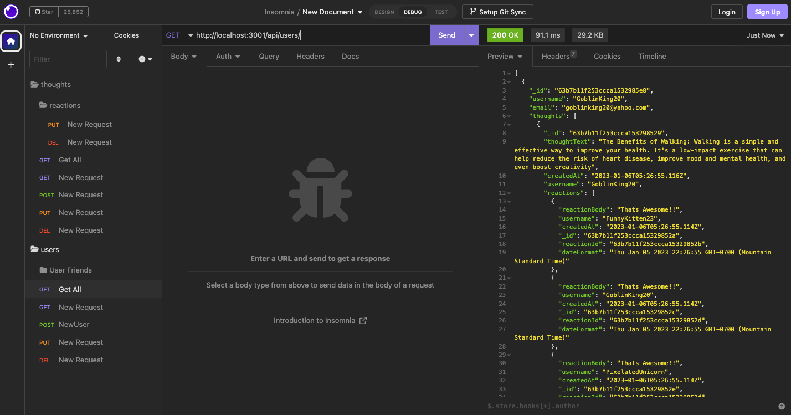

# Social Media Backend


This is basic backend layer for a social media website using mongoDB, mongoose, and express!

## Installation

Use Npm to install all the dependencies

```bash
npm i
```

Then use the seed data Script

```bash
npm run seed
```

Finally start the server

```bash
npm run start
```

## Media

### Screen Shots



### Demo

[Video Demo](https://youtu.be/YlWuW1lX-J4)

## License

[MIT](https://choosealicense.com/licenses/mit/)
